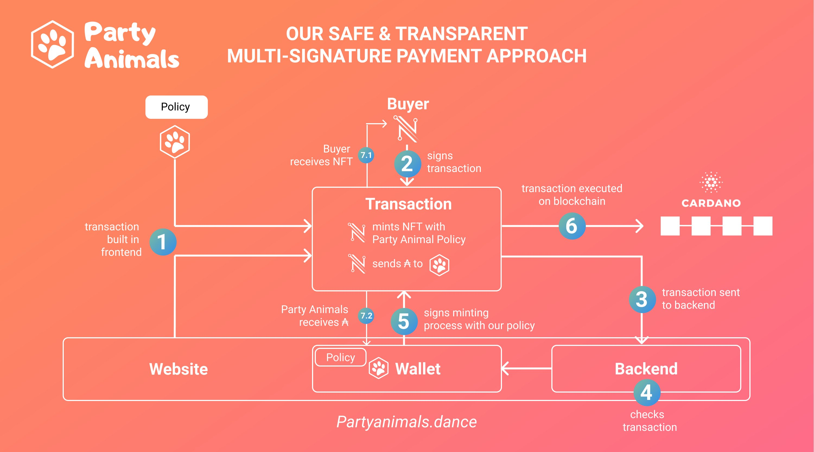

## Vending NFTs with NAMI using a secure multi-signature approach

Using a multi-signature approach for your NFT drop has many advantages:
- The buyer has full transparency over the transaction and NFTs they receive
- Lower transaction costs
- Less on-chain activity (1 instead of 2 transactions)

Have a look at the vending of [partyanimals.dance](https://partyanimals.dance/) where we implemented multi-signature vending. 

<p align="center"></p>

For more info have a look at this tweet: https://twitter.com/NFTPartyanimals/status/1461692541825396739?s=20

In the following, you find a brief description of how to implement multi-signature vending for your project! If you have any questions open an issue or contact us on twitter: https://twitter.com/CardanoFanB


# What you need: 
- Minting Wallet: This wallet owns your policy and is created in your backend. It does not contain any ADA.
- ADA receiving wallet: This wallet receives the ADA from the NFT sale. (E.g. ```addr1q8yex5e33wyuqys0htjr8rwa4wjh3lqfvrs4g4yxw3rywwk4d2snfsv2gcvrcqe42qmty897fnr0s9hv9dccsc6xxjgsx7vf0e```)
- Buyer Wallet: Frontend Nami wallet of NFT buyer

# Infrastructure
- An account and valid Blcokfrost API Key. [https://blockfrost.io/](https://blockfrost.io/)

- NodeJS backend server where you install the [```nami-node-js```](https://github.com/dendorferpatrick/nami-wallet-examples/tree/node-js). (I can highly recommend using google cloud service for your REST API receiving the transaction data. It is very easy to set up and deploy your model. 
For party animals we have an additional Rasberry Pi Running with our minting wallet but you can also run your wallet on the cloud service. )

- JS Frontend with installed [nami wallet](https://namiwallet.io) and nami-wallet-api [```nami-js```](https://github.com/dendorferpatrick/nami-wallet-examples) (I can recommend using google firebase)

- Any MySQL or NoSQL Database to keep track of NFTs you have already minted. 

## Backend
Clone our [```nami-node-js```](https://github.com/dendorferpatrick/nami-wallet-examples/tree/node-js) branch and install it on your backend server.
### 1. Create your minting wallet in the backend
Frist, you need a minting wallet. You can create a wallet by generating a new private key. 
IMPORTANT! Save the private key in a local config file but do not share it with anyone!
```js 
var NamiWalletApi = require('./nami').NamiWalletApi
let blockfrostApiKey = {
                        0: "yourBlockfrostTestnetApiKey", // testnet
                        1: "yourBlockfrostMainnetApiKey" // mainnet
                        }
//React example
var nami =  new NamiWalletApi( blockfrostApiKey )             
let privateKey = nami.createNewBech32PrivateKey()
console.log(privateKey)

'[ExampleOutput]: xprv1gz96va9rkqehrldyjf0y028uyjdys4nhcx2ay8grh0rhletfe9vx8dg446agpv6zhkduej72wafvn74nnjalpr9d8gpdc5q2kx3c5k6d30nw374pupfee9sydfwy0wpl53gey4fstfk5nvug2u92q2g3zstg2rv9'

```
Set the private key whenever you start your server.

```js
nami.setPrivateKey(privateKey)
```


### 2. Create your minting policy
Before you can start minting your NFTs you have to create a policy. Use a point in time, when your policy should expire. After generating the policy, store the policy information in a file.

```js
let networkId = 1 // mainnet
// example policy that expires in 24hrs from now
const expirationTime = new Date();
expirationTime.setTime(expirationTime.getTime() + (24 * 60 * 60 * 1000))  // 24hrs in milliseconds
let policy = await nami.createLockingPolicyScript(networkId, expirationTime)
console.log(policy)
'[ExampleOutput]:
Promise {
  {
    id: '8d5323696dc25bf6a5713067c007838a43d69285c41925065a5f2aef',
    script: '8201828200581c678cb06bda18daa1388ecdc2e140deb6e84f3a0b63333a3c66063d4782051a02f5b983',
    paymentKeyHash: '678cb06bda18daa1388ecdc2e140deb6e84f3a0b63333a3c66063d47',
    ttl: 49658243
  }
}'
```

### 3. Prepare your metadata
For minting NFTs on Cardano you have to follow the format 
```js
const metadata = {'721':  // 721 stands for NFTs
{
  [policyId]: {
    [NFTName]: {
     "name": "", 
     "image": "", 
     "description": "", 
     "etc...": ""
    }
    }
}

`Example` 
let metadata = {"721":
    {"8d5323696dc25bf6a5713067c007838a43d69285c41925065a5f2aef": // policyId
    {"MyNFT": // NFTName
    {"name":"MyNFT",
    "description":"This is a test NFT",
    "image":"ipfs://QmUb8fW7qm1zCLhiKLcFH9yTCZ3hpsuKdkTgKmC8iFhxV8"}}
    }
    }
```

### 4. Hash Metadata for transaction
Usually, we don't want that the NFT buyer sees the metadata before he has signed the transaction to keep the NFT secret. Therefore, we only send the hashed metadata to the client instead of the raw metadata. 
The client is not able to unhash the metadata and information about the metadata is all-time for the buyer concealed. The buyer only sees the name and quantity of the NFT. 
```js
const metaDataHash = nami.hashMetadata(metadata)
```

Finally, you have a `metadata` and `metadataHash` pair. The metadataHash is sent to the frontend. You can create all metadata hashes in advance and already store them in a file in your frontend. 
## Frontend
We have set up our wallet and policy in the backend. Now, we have to build the minting transaction on our website where we want to sell the NFT.

### 5. Create Transaction in Frontend
When the buyer activates your buy process, query your database which NFTs are free to be minted, and send the metadata Hash to the client. With this information, you can build the transaction. Usually, when you sell an NFT, the buyer mints themselves an NFT while the seller receives ADA in return. 
(To check which NFTs are already sold you can use this blockfrost api call https://docs.blockfrost.io/#tag/Cardano-Assets/paths/~1assets~1policy~1{policy_id}/get by using this function ```nami._blockfrostRequest``` of our nami API .)

As we only add the ```metadataHash``` to our frontend transaction, we have to also include some dummy metadata to correctly compute transaction fees. For this, just create new metadata (having similar size) with some dummy data. 
```js 
let paymentAddress = await nami.getAddress() // nami wallet address

// constructing recipients
// 1. Seller => ADA
// 2. Buyer => NFT 
let recipients = [
    {address: "addr1q8yex5e33wyuqys0htjr8rwa4wjh3lqfvrs4g4yxw3rywwk4d2snfsv2gcvrcqe42qmty897fnr0s9hv9dccsc6xxjgsx7vf0e", amount: "10"}, // Seller Wallet, NFT price 10ADA
    {address: "addr1qysjrwqv6uyu7gtwtzvhjceauj8axmrhssqf3cvxangadqzt5f4xjh3za5jug5rw9uykv2klc5c66uzahu65vajvfscshgt2vq",  amount: "0",
     mintedAssets:[{"assetName":"MyNFT","quantity":"1",
    "policyId":"8d5323696dc25bf6a5713067c007838a43d69285c41925065a5f2aef","policyScript":"8201828200581c678cb06bda18daa1388ecdc2e140deb6e84f3a0b63333a3c66063d4782051a02f5b983"}]} // NFTs to be minted
    ] // list of recipients
  
let dummyMetadata =  {"721":
    {"8d5323696dc25bf6a5713067c007838a43d69285c41925065a5f2aef": // policyId
    {"MyNFT": // NFTName
    {"name":"sfgsdfgdfsg",
    "description":"gsdfgdfsgdfsgdfsgdfsg",
    "image":"isdgdfsgdfsgdfsgdfsgdfsgdfsgdfsgdfsgdfsgdfsgdfgdfgdfsgdfsgdfsgdfsg"}}
    }
    }
let transaction = await nami.transaction(
    PaymentAddress = paymentAddress, 
    utxos = (await nami.getUtxosHex()), 
    recipients = recipients, 
    metadata = dummyMetadata,       //  dummy metadata to compute transaction fees
    metadataHash = metadataHash,    // add metadataHash to transaction (not invertable)
    addMetadata = false,            // not adding metadata to transaction
    multiSig = true,                // enable multi-signature
)
```
### 6. Buyer signs transaction in frontend
Once the transaction is built, the buyer can sign it.
```js
const witnessBuyer = await nami.signTx(transaction, true)
`[ExampleOutput]:a1008182582064898f81ed0f5d017b27358f9b8d848ab12c97c7a01f96921881773d0c7587a858401ae8e9bd9ecc7aa14e93cf3e58b6629015faeb7cb0db712ebca19c98d8a3397e90777803f29329c49c3a6f493cfce17c39f2b5c55a190c640889d207bb83280c`
```
### 7. Send transaction and witness to backend
Now, we have to send the transaction and buyer witness to our backend. For this, we have to set up a REST API with ```nodeJS``` and ```express``` and make a post request from our frontend. 

Then, we will receive the strings ```transaction``` and ```witnessBuyer```.
If our REST API is addressed, we can ping our nami backend.

### 8. Decode transaction and check if the transaction is correct
Remember, the client can modify anything in your frontend so we have to double-check if the transaction is correct. Hence, we will decode the transaction again and check if the input and outputs are correct before we sign and validate the transaction.

```js
let transaction ="84a600888258201766ebeaf1533ce290c080b22f51cffcddb9bf6a58afe76983bc187da0ad140001825820cc28c7228c4de20690e17892e18e50fc0301037b494c34ec7e204ce615ccdce00182582029d2e9aebc3974f302d5510da28033b0ca390225a41078f285d1fac638c005cd018258209cadb73acd523201eeb406a5683beb75ce5f77fa9c4b1d96d5824dff901e990601825820a74cc51d257177664b6b92c791705bf70adcd55df2b1c3233778cab3c96ff94f01825820b7bf56bb9a9dcdd768fb1adbb608425466534aac36589c69af5f548f8f93149d01825820edbd034b7dea0d947a7d19229d1623f72ef5bbca78a647285ad3d439b39a211c01825820a003ac4d6e2dafbd2a36777d803ee6092e2adf0deab045eb71733c9b83dec51101018282583901c99353318b89c0120fbae4338dddaba578fc0960e15454867446473ad56aa134c18a46183c03355036b21cbe4cc6f816ec2b7188634634911a004c4b40825839012121b80cd709cf216e589979633de48fd36c77840098e186ecd1d6804ba26a695e22ed25c4506e2f09662adfc531ad705dbf3546764c4c31821a0041a447a1581c8d5323696dc25bf6a5713067c007838a43d69285c41925065a5f2aefa1454d794e465401021a000305d9031a02f5c5a207582082f454f4383cf957db902f4604158d53ac0adef41f4172c7ed94346a58650fdf09a1581c8d5323696dc25bf6a5713067c007838a43d69285c41925065a5f2aefa1454d794e465401a101818201828200581c678cb06bda18daa1388ecdc2e140deb6e84f3a0b63333a3c66063d4782051a02f5b983f5a11902d1a178383864353332333639366463323562663661353731333036376330303738333861343364363932383563343139323530363561356632616566a1654d794e4654a36b6465736372697074696f6e725468697320697320612074657374204e465465696d6167657835697066733a2f2f516d556238665737716d317a434c68694b4c634648397954435a33687073754b646b54674b6d4338694668785638646e616d65654d794e4654"
let [inputs, outputs, metadata, fee] = await nami.decodeTransaction(transaction, networkId) 
```
Now, you can deploy your logic to check if the transaction is correct.
### 9. Sign transaction with your private key
When the transaction is correct, we can also sign the transaction and add our witness. 
```js
let witnessMinting = nami.signTx(transaction)
```

### 10. Submit Transaction 
Finally, we combine the witnesses ```witnessBuyer``` and ```witnessMinting``` and add the final metadata. Now we can submit the transaction onto the blockchain via the blockfrost API.
```js 
let witnesses = [witnessBuyer, witnessMinting]

//Example 
let txHash = await nami.submitTx( {transactionRaw: transaction,
                witnesses: witnesses, 
                networkId : networkId, 
                metadata: metadata // add real metadata)
console.log(txHash)
```
If everything worked out fine, we receive a valid transaction hash. 

Have fun minting!

